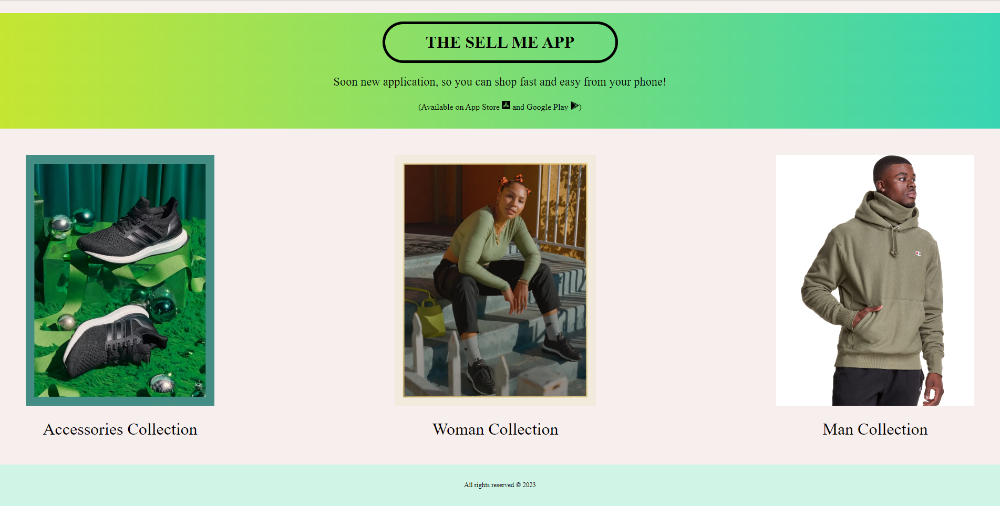
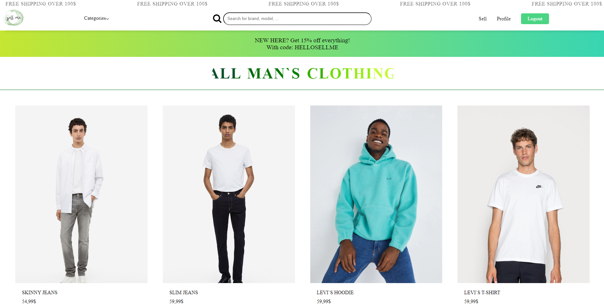
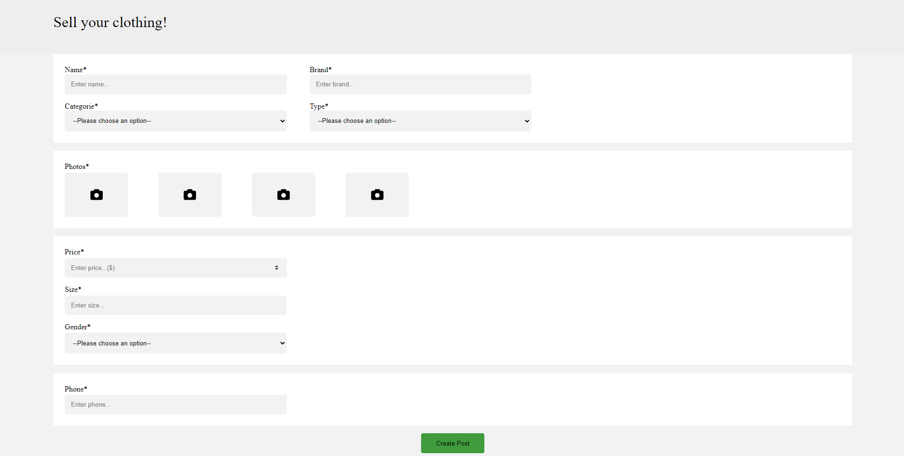
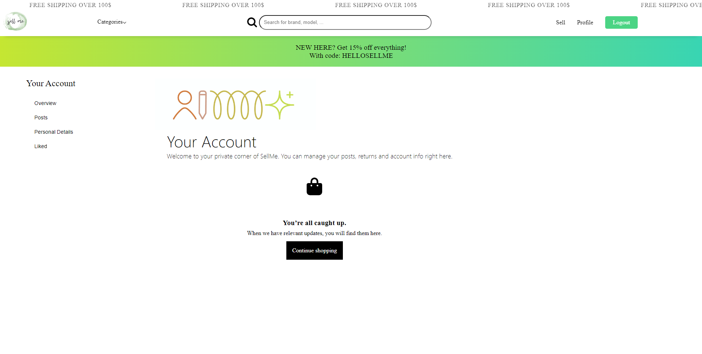

# Sell Me

> A React project with a firebase backend.

## Table of Contents
* [General Information](#general-information)
* [Built With](#built-with)
* [How It Works](#how-it-works)
* [Features](#features)
* [Screenshots](#screenshots)
* [Setup](#setup)

## ℹ️ General Information
<a name="general-information" />

The Sell Me is a project created for people who want to sell their clothes fast and easy. People can not only post their clothes but also find something for themselves.
The project was created as a project assignment for [ReactJS - октомври 2023](https://softuni.bg/trainings/4238/reactjs-october-2023).

## ⚒️ Built With
<a name="built-with"/>

## The following packages are used in the frontend project: 
    "@testing-library/jest-dom": "^5.17.0",
    "@testing-library/react": "^13.4.0",
    "@testing-library/user-event": "^13.5.0",
    "react": "^18.2.0",
    "react-dom": "^18.2.0",
    "react-router-dom": "^6.17.0",
    "react-scripts": "5.0.1",
    "web-vitals": "^2.1.4"
    

## 💁 How It Works
<a name="how-it-works"/>

### Guests:
Can view the homepage,\
browse all available clothes,\
view a post details,\
login/register,\

### Logged-In Users:
Can view the homepage,\
browse all available clothes,\
view a post details,\
create/update their posts,\
like posts,\

<a name="features"/>

- CRUD operations for clothes
- Client-side validations
- Client-side search

## 📷 Screenshots
<a name="screenshots"/>

## ⚙️ Setup
<a name="setup"/>

1. **Clone the Repository**
2. **Open a terminal and run the following commands:**
   npm install
   npm start